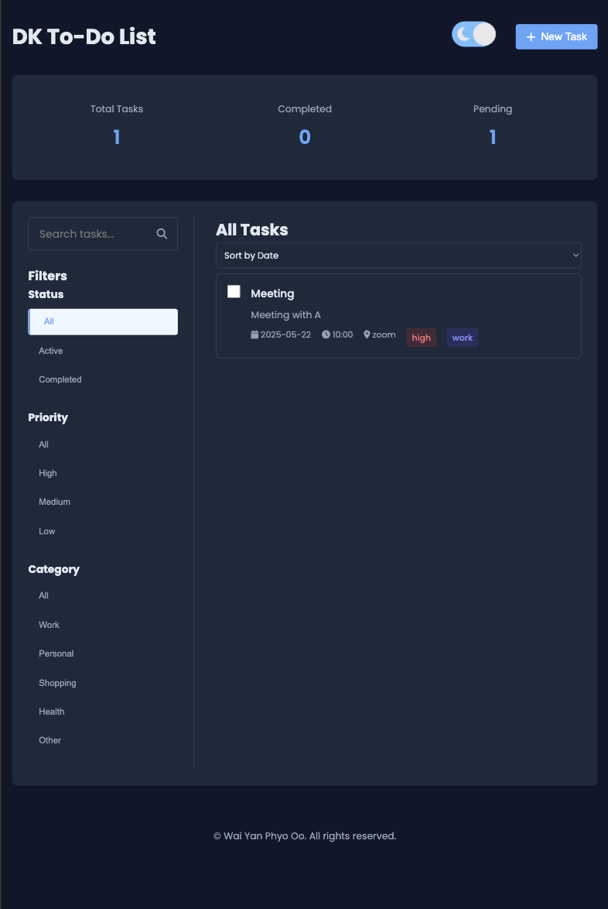
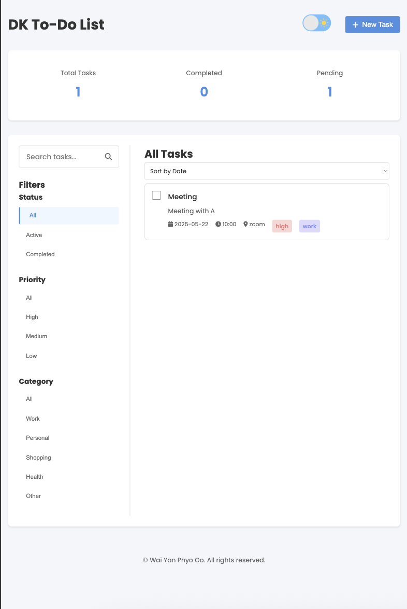

# DK To-Do List

A modern, feature-rich to-do list application built with HTML, CSS, and JavaScript. This application helps you manage your tasks efficiently with a beautiful and intuitive user interface.

## 🌐 Live Demo

🔗 [View Website](https://waiyanphyooo21.github.io/to-do/)

## 📸 Screenshots

### 🌙 Dark Mode  

### ☀️ Light Mode  

## Features

- ✨ Modern and responsive design
- 🌓 Dark/Light mode with animated toggle
- 📱 Mobile-friendly interface
- ✅ Task management with completion status
- 🏷️ Priority levels (High, Medium, Low)
- 📂 Category organization
- 🔍 Search functionality
- 📅 Due date and time setting
- 📍 Location tracking
- ⏰ Reminder system
- 📎 File attachments support
- 🔄 Task filtering and sorting
- 📊 Task statistics dashboard

## Task Management Features

- Create new tasks with detailed information
- Edit existing tasks
- Mark tasks as complete/incomplete
- Delete tasks
- Filter tasks by:
  - Status (All, Active, Completed)
  - Priority (All, High, Medium, Low)
  - Category (Work, Personal, Shopping, Health, Other)
- Sort tasks by:
  - Date
  - Priority
  - Category

## Task Properties

Each task can include:
- Title
- Description
- Due date and time
- Priority level
- Category
- Location
- Reminder settings
- File attachments

## Theme Support

The application features a beautiful dark/light mode toggle:
- Animated sun/moon icons
- Smooth transitions between themes
- Persistent theme preference
- Automatic theme restoration
- Optimized colors for both modes

## Technologies Used

- HTML5
- CSS3
- JavaScript (ES6+)
- Local Storage for data persistence
- Font Awesome for icons
- Google Fonts (Poppins)
- SVG animations

## Browser Support

The application works best on modern browsers:
- Chrome (latest)
- Firefox (latest)
- Safari (latest)
- Edge (latest)

## Local Storage

The application uses the browser's local storage to save:
- Your tasks
- Theme preference
- All data persists even after closing the browser

## Contributing

Feel free to submit issues and enhancement requests!

## License

© Wai Yan Phyo Oo. All rights reserved. 

## 💻 Getting Started

1. Clone the repo:
git clone https://waiyanphyooo21.github.io/to-do.git
2. Open `index.html` in your browser or use Live Server in VS Code.

## 📬 Contact

- Email: dm@waiyanphyooo.online
- GitHub: [@waiyanphyooo21](https://github.com/waiyanphyooo21)

## ⭐️ Show Your Support

If you like this project, consider giving it a ⭐️ on [GitHub](https://waiyanphyooo21.github.io/to-do/)!
